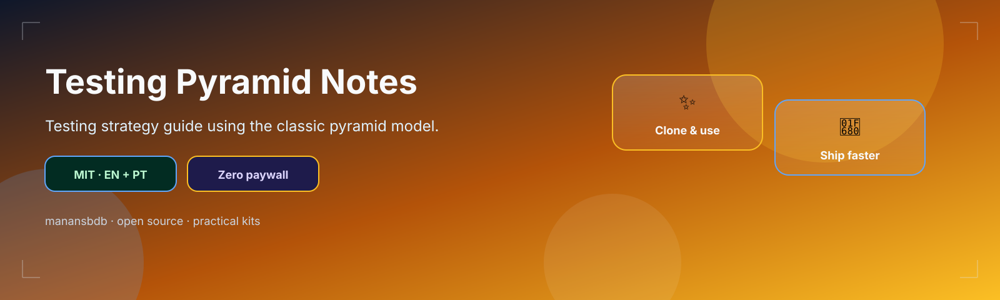
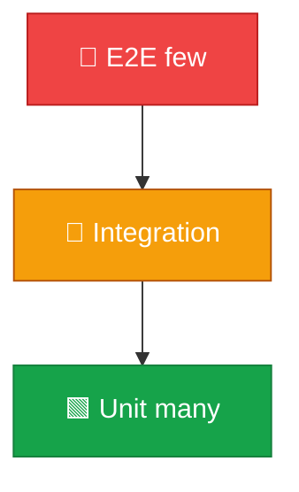

<p align="center">
  
</p>

<h1 align="center">testing-pyramid-notes</h1>

<p align="center">
  <strong>EN</strong> Testing pyramid guide + practical tips<br/>
  <strong>PT</strong> Guia da pirâmide de testes + dicas práticas
</p>

<p align="center">
  <a href="https://github.com/manansbdb/testing-pyramid-notes/blob/main/LICENSE"></a>
  
  
  <a href="#support--apoio"></a>
</p>

---

## What it does / Para que serve

| English | Português |
|---------|-----------|
| A clear **testing pyramid** overview and practical tips for balancing unit / integration / E2E. | Uma visão clara da **pirâmide de testes** e dicas para equilibrar unit / integração / E2E. |
| Share with teams when deciding where to invest automation. | Partilha com a equipa ao decidir onde investir em automação. |



---

## Install / Instalação

### 1) Clone / Clona

```bash
git clone https://github.com/manansbdb/testing-pyramid-notes.git
cd testing-pyramid-notes
```

### 2) Copy / Copia

```bash
mkdir -p docs/testing
cp pyramid.md docs/testing/
cp practical-tips.md docs/testing/
```

### Requirements / Requisitos

- `git`
- No runtime dependencies

---

## Quick start / Início rápido

```bash
git clone https://github.com/manansbdb/testing-pyramid-notes.git
# open pyramid.md + practical-tips.md in your next test-strategy meeting
```

---

## Contents / Conteúdos

| Path | Purpose / Função |
|------|------------------|
| `pyramid.md` | Pyramid overview |
| `practical-tips.md` | Day-to-day tips |
| `SUPPORT.md` | Donations / Doações |

---

## Project layout / Estrutura

```text
testing-pyramid-notes/
├── docs/banner.svg
├── pyramid.md
├── practical-tips.md
├── SUPPORT.md
└── README.md
```

---

## Support / Apoio

Bitcoin donations welcome / Doações em Bitcoin bem-vindas:

```
bc1q0qfnlnxyum9u45stzxe0a7jnhtj4j0usfkqdjw
```

See [SUPPORT.md](./SUPPORT.md).

---

## License / Licença

[MIT](./LICENSE) © 2026 manansbdb
